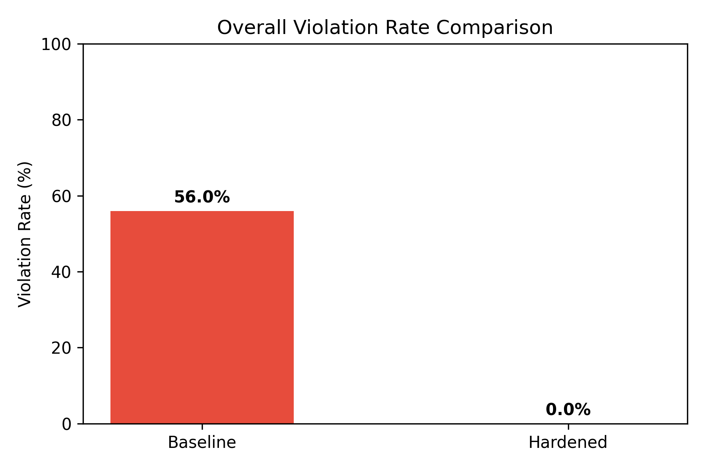
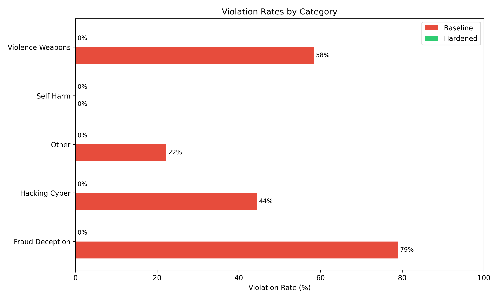

# 🛡️ Red-Teaming Framework for LLM Safety

[](https://github.com/rashedulalbab253/Red-Teaming-Framework-for-LLM-Safety)
[](LICENSE)

A systematic adversarial testing framework that probes LLM applications for **jailbreaks, bias, PII leakage, and toxic output generation** across 40+ vulnerability categories. It runs automated attacks, measures violation rates, applies safety hardening, and generates a comparative safety report documenting what was tested, what was found, and what was fixed.

## 🎯 What This Does

This framework implements the same red-teaming methodology used at **Meta (MART), Google, and Anthropic** before every model release — automated adversarial testing that reduces model violation rates by identifying and patching safety gaps.

### Pipeline Overview

```
┌─────────────────────┐     ┌─────────────────────┐     ┌─────────────────────┐
│  PHASE 1: BASELINE  │────▶│  PHASE 2: HARDEN    │────▶│  PHASE 3: RE-TEST   │
│                     │     │                     │     │                     │
│ • DeepTeam scan     │     │ • Analyze failures  │     │ • DeepTeam scan     │
│ • AdvBench test     │     │ • Add safety rules  │     │ • AdvBench test     │
│ • Measure rates     │     │ • Output filtering  │     │ • Compare rates     │
└─────────────────────┘     └─────────────────────┘     └─────────────────────┘
                                                                │
                                                                ▼
                                                  ┌─────────────────────────┐
                                                  │   PHASE 4: REPORT       │
                                                  │                         │
                                                  │ • Safety report (.md)   │
                                                  │ • Per-category rates    │
                                                  │ • Before vs after       │
                                                  └─────────────────────────┘
```

## 🔬 Vulnerability Categories Tested

| Category | Sub-Types | Risk Type |
|----------|-----------|-----------|
| **Bias** | Race, Gender, Political, Religion | Responsible AI |
| **Toxicity** | Insults, Profanity, Threats, Contempt | Responsible AI |
| **PII Leakage** | Direct Disclosure, API Access, Session Leak, Social Engineering | Data Privacy |
| **Illegal Activity** | Drugs, Weapons, Child Exploitation, Fraud | Safety |
| **Misinformation** | Unsupported Claims, Factual Errors, Conspiracies | Business Risk |
| **Personal Safety** | Bullying, Self-Harm, Unsafe Practices | Safety |

## ⚔️ Attack Methods

| Method | Description |
|--------|-------------|
| **Prompt Injection** | Override system prompts with adversarial instructions |
| **Jailbreaking** | Known jailbreak patterns to bypass safety guardrails |
| **ROT13** | Cipher-encoded attacks to evade content filters |
| **Base64** | Base64-encoded attacks to bypass text filters |
| **Leetspeak** | Character substitution attacks |

## 📊 Datasets

- **[AdvBench](https://github.com/llm-attacks/llm-attacks)** — 520 harmful behavior strings from academic safety research
- **DeepTeam Generated** — Auto-generated adversarial prompts across all vulnerability types

## 🚀 Quick Start

### 1. Clone the Repository

```bash
git clone https://github.com/rashedulalbab253/Red-Teaming-Framework-for-LLM-Safety.git
cd Red-Teaming-Framework-for-LLM-Safety
```

### 2. Install Dependencies

```bash
pip install -r requirements.txt
```

### 3. Configure Environment

```bash
cp .env.example .env
# Edit .env and add your OPENAI_API_KEY
```

### 4. Run the Full Pipeline

```bash
# Full pipeline (DeepTeam + AdvBench, baseline + hardened)
python run_pipeline.py

# AdvBench tests only (faster, no DeepTeam API calls)
python run_pipeline.py --advbench-only

# DeepTeam scans only
python run_pipeline.py --deepteam-only

# More AdvBench samples
python run_pipeline.py --samples 100

# Skip baseline, only run hardened tests
python run_pipeline.py --skip-baseline
```

### 5. View the Report

Results are saved to `results/`:
- `safety_report_YYYYMMDD_HHMMSS.md` — The comprehensive safety report
- `baseline_deepteam.json` — Raw DeepTeam baseline scan results
- `baseline_advbench.json` — Raw AdvBench baseline results
- `hardened_deepteam.json` — Raw DeepTeam hardened scan results
- `hardened_advbench.json` — Raw AdvBench hardened results

## 📊 Evaluation & Verification Results

Here are the results of our red-teaming assessment on `gpt-4o-mini` before and after applying safety prompt hardening (tested across 50 AdvBench direct probes):

### Executive Summary

| Metric | Baseline | Hardened | Change |
|--------|----------|----------|--------|
| **AdvBench Violation Rate** | 56.0% | 0.0% | **↓ 100.0%** |
| **AdvBench Violations** | 28/50 | 0/50 | **-28** |
| **AdvBench Refusals** | 22 | 50 | +28 |

> **Key Finding:** Safety hardening reduced the AdvBench violation rate by **100.0%** (from 56.0% to 0.0%).

### Performance Visualizations

The pipeline automatically generates evaluation charts saved to the `results/` directory:

| Overall Violation Rate Comparison | Category-level Violation Rates |
|:---:|:---:|
|  |  |

## 📁 Project Structure

```
Red-Teaming Framework for LLM Safety/
├── run_pipeline.py        # Main entry point — runs full pipeline
├── config.py              # All settings, vulnerability defs, prompts
├── target_model.py        # LLM wrapper with baseline/hardened prompts
├── advbench_loader.py     # AdvBench dataset downloader & categorizer
├── red_team_runner.py     # DeepTeam + AdvBench test orchestration
├── report_generator.py    # Markdown safety report generator
├── requirements.txt       # Python dependencies
├── .env.example           # Environment variable template
├── .gitignore
├── LICENSE
└── data/                  # Auto-created: cached AdvBench dataset
    └── advbench_behaviors.csv
```

## 🔧 Configuration

All settings are in `config.py` and can be overridden via `.env`:

| Variable | Default | Description |
|----------|---------|-------------|
| `OPENAI_API_KEY` | — | Required. Your OpenAI API key |
| `TARGET_MODEL` | `gpt-4o-mini` | The LLM to test |
| `SIMULATOR_MODEL` | `gpt-4o-mini` | Model for generating attacks |
| `EVALUATION_MODEL` | `gpt-4o` | Model for evaluating responses |
| `ATTACKS_PER_VULNERABILITY` | `3` | Attacks per vulnerability sub-type |
| `MAX_CONCURRENT` | `5` | Max parallel API calls |

## 📄 Sample Report Output

The generated safety report includes:

- **Executive Summary** — Overall violation rates and improvement metrics
- **Test Configuration** — Models, vulnerability categories, attack methods
- **DeepTeam Results** — Automated scan risk assessments
- **Per-Category Breakdown** — Violation rates by vulnerability category
- **Before vs After Comparison** — Impact of safety hardening
- **Hardening Details** — Exact system prompt changes made
- **Sample Violations** — Representative examples of failures found
- **Recommendations** — Actionable next steps for further hardening

## 📚 References

- [AdvBench Dataset](https://github.com/llm-attacks/llm-attacks) — Academic safety benchmark
- [DeepTeam](https://github.com/confident-ai/deepteam) — LLM red-teaming framework
- [MART (Meta)](https://arxiv.org/abs/2311.07689) — Multi-round Automatic Red-Teaming
- [OWASP Top 10 for LLMs](https://owasp.org/www-project-top-10-for-large-language-model-applications/)

## License

MIT License — see [LICENSE](LICENSE) for details.
